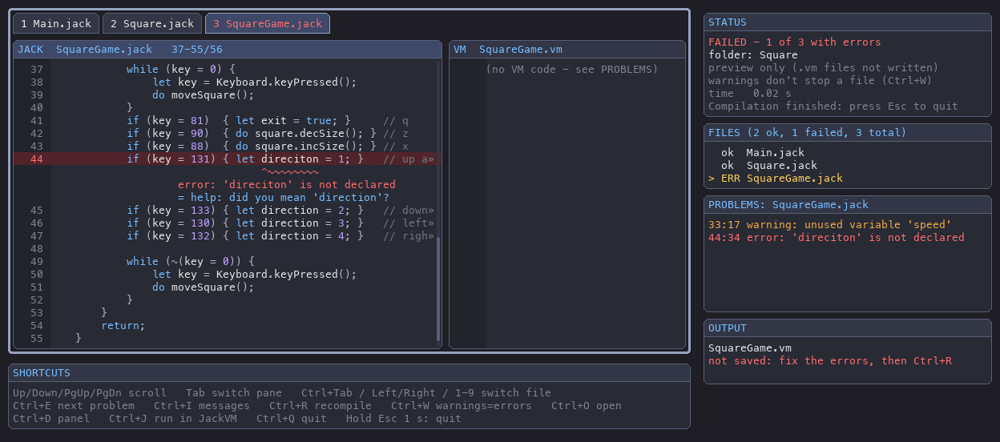

# Jack Compiler for nand2tetris

[](https://github.com/kpillai2017/jack-compiler/actions/workflows/ci.yml)
[](LICENSE)
[](https://www.python.org/)
[](https://kpillai2017.github.io/jack-compiler/)

📖 **Documentation:** <https://kpillai2017.github.io/jack-compiler/>

🎮 **Run what you compile:** [jackvm-py](https://github.com/kpillai2017/jackvm-py), the companion
Jack VM with a game window and memory debugger. See [Using it with JackVM](#using-it-with-jackvm).

A complete, production-ready Jack compiler implementation using ANTLR4 that translates Jack source code to Hack Virtual Machine (VM) code.

## Overview

This compiler implements the full Jack language specification from the nand2tetris course. It is built with Terence Parr's ANTLR4 parser generator and includes:

- **Lexical Analysis**: Tokenization with full comment and string literal support
- **Syntax Analysis**: Complete ANTLR4 grammar with visitor pattern implementation
- **Semantic Analysis**: Symbol table management with class and subroutine scopes, type tracking
- **Code Generation**: Translation to Hack VM bytecode format
- **Comprehensive Testing**: Unit tests plus end-to-end golden-file tests, run on every push via GitHub Actions

## Features

✅ **Language Support**
- Variables: static, field, local, and parameter variables
- Data Types: int, boolean, String, and custom class types
- Operators: arithmetic, relational, logical, and unary operators
- Control Flow: if/else statements, while loops, function calls
- Subroutines: functions, methods, and constructors with proper scoping
- Arrays: single-dimensional array operations
- String & Integer Literals: with proper character encoding
- Comments: single-line (//) and block (/* */) comments

✅ **Code Quality**
- Clean separation of concerns (lexer, parser, symbol table, code generation)
- ANTLR4 visitor pattern for AST traversal
- Proper symbol table scoping (class and subroutine levels)
- Comprehensive error handling

✅ **Usability**
- Simple command-line interface
- Single file and batch directory compilation
- Example programs demonstrating all language features
- Detailed documentation and usage guide

## Project Structure

```
jack-compiler/
├── .github/workflows/ci.yml     # GitHub Actions: tests + grammar drift check
├── .gitignore / .gitattributes
├── LICENSE                      # MIT
├── README.md                    # This file
├── USAGE.md                     # Detailed usage guide
├── ARCHITECTURE.md              # Architecture documentation
├── QUICK_REFERENCE.md           # Quick reference guide
├── ERROR_DETECTION.md           # Error handling documentation
├── REFERENCE_COMPATIBILITY.md   # Compatibility with the nand2tetris web-ide
├── IMPLEMENTATION_SUMMARY.md    # Implementation overview
├── pyproject.toml               # Package configuration (provides `jackc` and `jackc-gui`)
├── requirements.txt             # Runtime dependency pin
├── config.example.ini           # Template for ~/.config/jack-tools/config.ini (finding JackVM)
├── antlr-4.13.0-complete.jar    # ANTLR4 tool (only needed to regenerate the parser)
│
├── jack_compiler/               # SOURCE CODE (Python package)
│   ├── __init__.py              # Public API
│   ├── __main__.py              # Enables `python -m jack_compiler`
│   ├── compiler.py              # Compiler driver + CLI (`jackc`)
│   ├── compiler_visitor.py      # Parse-tree visitor: AST + VM code generation
│   ├── symbols.py               # Symbol table implementation
│   ├── codegen.py               # VM code emitter
│   ├── integrations.py          # Finds JackVM (shared with jackvm-py)
│   ├── locate_app.py            # Ctrl+J's "where is JackVM?" folder chooser (shared too)
│   ├── gui/                     # pygame front end (`jackc-gui`), see "Graphical Interface"
│   └── antlr_generated/         # ANTLR4-generated lexer/parser (committed)
│       └── grammar/
│
├── grammar/
│   └── Jack.g4                  # ANTLR4 grammar for the Jack language
├── examples/                    # Example Jack programs
├── tests/
│   ├── test_compiler.py         # Unit, end-to-end and CLI tests
│   └── expected/                # Golden VM output for the examples
└── docs/                        # HTML documentation site (published via GitHub Pages)
```

## Quick Start

```bash
git clone https://github.com/kpillai2017/jack-compiler.git
cd jack-compiler
python3 -m venv venv && source venv/bin/activate   # Windows: venv\Scripts\activate
pip install --upgrade pip
pip install -e ".[dev,gui]"               # jackc, jackc-gui (the window) and pytest

jackc examples/HelloWorld.jack            # writes examples/HelloWorld.vm
jackc examples/ -o output/                # compile a whole directory
jackc-gui examples/                       # see the Jack and VM code side by side
pytest                                    # run the test suite
```

No Java is required to *use* the compiler — the generated parser is committed.
Every new virtual environment starts empty, so run the `pip install` line once
in each one (see [Troubleshooting](#troubleshooting) if a command isn't found).

## Installation Details

### Prerequisites

- **Python** 3.8 or higher
- **pip** 21.3+ (for editable installs from `pyproject.toml`)
- **Java** JDK 11+ — *only* if you modify `grammar/Jack.g4`

### Install options

```bash
pip install -e ".[dev,gui]" # editable install + pygame (jackc-gui) + pytest (recommended)
pip install -e ".[dev]"     # the same without the window
pip install .               # regular install
pip install -r requirements.txt && python -m jack_compiler ...   # no install, run from repo root
```

### Regenerating the Parser and Lexer

Only needed after editing `grammar/Jack.g4`:

```bash
java -jar antlr-4.13.0-complete.jar \
    -Dlanguage=Python3 \
    -visitor \
    -o jack_compiler/antlr_generated \
    grammar/Jack.g4
```

Generated files are written to `jack_compiler/antlr_generated/grammar/`. Commit them —
CI regenerates the parser and fails if the committed files are out of date.

### Troubleshooting

#### "jackc: command not found" / "jackc-gui: command not found"
The commands only exist in a virtual environment the package was installed into.

- **A new environment is empty.** `python3 -m venv`, and direnv's `layout python`
  (in an `.envrc`), both create a fresh one with nothing in it. Install into it
  once: `pip install -e ".[dev,gui]"`.
- **Is the right one active?** `which python` (Windows: `where python`) should
  point inside it, and `pip show jack-compiler` should find the package.
- **`jackc` works but not `jackc-gui`?** It was installed without the window:
  run `pip install -e ".[gui]"`.
- **No install at all:** `python -m jack_compiler` and `python -m jack_compiler.gui`
  work from the repository root after `pip install -r requirements.txt`
  (plus `pip install pygame` for the window).

#### "jackc-gui needs pygame"
pygame isn't installed in the Python that's running. The message names that
Python, and the command to fix it: `pip install -e "<this checkout>[gui]"`.

#### "ModuleNotFoundError: No module named 'antlr4'"
```bash
pip install -r requirements.txt
```

#### "editable mode currently requires a setuptools-based build"
Your pip is too old for `pyproject.toml` editable installs: `pip install --upgrade pip`.

#### "Java not found" (only when regenerating the parser)
- **macOS**: `brew install openjdk`
- **Ubuntu/Debian**: `sudo apt-get install openjdk-17-jdk`
- **Windows**: `choco install openjdk` or download from [adoptium.net](https://adoptium.net/)

## Example Programs

### Example 1: Hello World
```jack
class HelloWorld {
    function void main() {
        do Output.printString("Hello, World!");
        do Output.println();
        return;
    }
}
```

### Example 2: Arithmetic & Variables
```jack
class Math {
    function void main() {
        var int x, y, sum;
        let x = 10;
        let y = 20;
        let sum = x + y;
        do Output.printInt(sum);
        return;
    }
}
```

### Example 3: Loops
```jack
class Loop {
    function void main() {
        var int i, sum;
        let i = 0;
        let sum = 0;
        while (i < 10) {
            let i = i + 1;
            let sum = sum + i;
        }
        do Output.printInt(sum);
        return;
    }
}
```

### Example 4: Object-Oriented Programming
```jack
class Point {
    field int x, y;
    
    constructor Point new(int px, int py) {
        let x = px;
        let y = py;
        return this;
    }
    
    method int getX() {
        return x;
    }
    
    method void dispose() {
        do Memory.deAlloc(this);
        return;
    }
}
```

See `USAGE.md` for more detailed examples and advanced usage.

## Architecture

### Compilation Pipeline

```
Jack Source Code
       ↓
[Lexer] (ANTLR4 generated)
       ↓
Token Stream
       ↓
[Parser] (ANTLR4 generated)
       ↓
Parse Tree
       ↓
[Visitor] Traverses tree, manages symbol table
       ↓
[Code Generator] Emits VM instructions
       ↓
Hack VM Code
```

### Symbol Table Design

Two-level scoping:
- **Class Scope**: Static and field variables (persistent across all subroutines)
- **Subroutine Scope**: Local variables and parameters (reset for each subroutine)

Variables are tracked with:
- Name, type, kind (static/field/local/arg), and index
- Proper handling of implicit 'this' pointer for methods

### Code Generation Strategy

- Stack-based VM architecture
- Direct instruction emission for each language construct
- Label generation for control flow (if/while)
- Proper handling of method calls with implicit 'this'
- String literal generation through character appending

## Testing

```bash
pytest -v
```

Tests cover:
- Symbol table operations (define, lookup, scoping)
- Code generation (arithmetic, jumps, function calls, strings)
- End-to-end compilation of every program in `examples/`, compared byte-for-byte with `tests/expected/*.vm`
- CLI behaviour and error handling (syntax errors, missing files)

If you intentionally change code generation, regenerate the golden files:

```bash
for f in examples/*.jack; do jackc "$f" -o "tests/expected/$(basename "${f%.jack}").vm"; done
```

## Command-Line Usage

```bash
jackc [-h] [-o OUTPUT] [-r] [--clean] [-n] [-v] [--version] input
# or: python -m jack_compiler ...

Arguments:
  input                 Input Jack file or directory
  -o, --output OUTPUT   Output VM file or directory (default: same as input)
  -r, --recursive       Also compile sub-directories, mirroring the tree under OUTPUT
  --clean               Delete ALL existing .vm files in each output directory first
                        (single file: only its own .vm)
  -n, --dry-run         Show what would be cleaned/compiled; change nothing
  -v, --verbose         Show full tracebacks for internal compiler errors
  -w, --no-warnings     Do not print warnings (errors are always shown)
  --werror              Treat warnings as errors
  --version             Show version and exit
  -h, --help            Show help message
```

### Batch compilation

```bash
jackc src/                         # every .jack in src/ (not sub-directories)
jackc -r projects/                 # whole tree, .vm written next to each .jack
jackc -r projects/ -o build/       # whole tree, mirrored under build/
jackc -r --clean --dry-run projects/   # preview a clean rebuild
jackc -r --clean projects/         # clean rebuild (no stale .vm left if a file fails)
```

Hidden directories (e.g. `.git`, `.venv`) are skipped. `--clean` only touches
directories that receive output, but removes *every* `.vm` file there — use
`--dry-run` first if those directories contain hand-written VM code.
Exit status is non-zero if any file fails; a summary lists the failed files.

Coloured output is disabled automatically when stdout is not a terminal or when `NO_COLOR` is set.

### Python API

```python
from jack_compiler import JackCompiler, JackSyntaxError

JackCompiler().compile_file("Main.jack", "Main.vm")      # returns True/False

try:
    vm_code = JackCompiler().compile_source("Main.jack")  # returns VM code as a string
except JackSyntaxError as e:
    print("\n".join(e.errors))                           # "Main.jack:4:9: ..." (1-based)
```

Errors and warnings are reported compiler-style, with the source line and a
`^~~~` marker under the exact spot:

```
Main.jack:14:13: error: 'cuont' is not declared
 14 |         let cuont = 1;
    |             ^~~~~
    = help: did you mean 'count'?
```

Besides syntax errors, a semantic pass catches undeclared or duplicate names,
methods called without an object, wrong argument counts, misspelt Jack OS
calls (`Output.printSting`), missing `return`s and more, and warns about
unused variables and unreachable code. See [ERROR_DETECTION.md](ERROR_DETECTION.md).

## Graphical Interface (`jackc-gui`)

A pygame window for compiling and browsing the result, styled like the
[jackvm-py](https://github.com/kpillai2017/jackvm-py) player, so the compiler and the
VM feel like one tool. The full guide is
[The Compiler Window](https://kpillai2017.github.io/jack-compiler/gui.html)
([docs/gui.html](docs/gui.html)).



```bash
pip install -e ".[gui]"          # adds pygame

jackc-gui                        # choose a .jack file or folder in a window
jackc-gui examples/              # compile a folder straight away
jackc-gui examples/Math.jack     # ...or one file
jackc-gui -r projects/           # a whole tree, like jackc -r
jackc-gui src/ -o bin/           # write the .vm files to bin/
jackc-gui -o bin/                # choose in a window; the .vm files go to bin/
jackc-gui --no-write src/        # preview only: never write .vm files
jackc-gui --werror src/          # warnings count as errors, like jackc --werror
python -m jack_compiler.gui ...  # the same, without installing
```

The window shows the selected `.jack` file next to the VM code it compiles to.
Errors and warnings appear the way the compiler prints them: the line is shaded
red or amber, and a `^~~~` marker under the exact spot carries the message,
with any `help:` / `note:` lines beneath it. Beside them are the
STATUS / FILES / PROBLEMS / OUTPUT boxes, and under them a SHORTCUTS box.
`.vm` files are written where `jackc` would put them (or where `-o` says).
To save them somewhere else, press **Ctrl+Shift+S** and choose a folder.

| Key | Action |
|-----|--------|
| Up / Down / PgUp / PgDn / Home / End, mouse wheel | Scroll the code |
| Tab (or click a pane) | Switch between the Jack and VM panes |
| Click a file tab, Ctrl+Tab / Ctrl+Shift+Tab, Ctrl+PgDn / Ctrl+PgUp, Left / Right, 1–9, wheel over the tabs, or click in FILES | Switch file: both panes show that `.jack` file and its compiled VM code |
| Ctrl+E | Jump to the next error or warning |
| Ctrl+I | Show / hide the compiler messages under the code |
| Ctrl+R | Recompile (re-reads the files, so edit in your editor and press Ctrl+R) |
| Ctrl+W | Warnings count as errors (like `--werror`), or back again; recompiles. STATUS shows which |
| Ctrl+J | Run the program in [JackVM](https://github.com/kpillai2017/jackvm-py). If JackVM isn't found yet, it asks where it is ([details](#using-it-with-jackvm)) |
| Ctrl+O | Open another file or folder |
| Ctrl+S | Save the `.vm` files (also after `--no-write`) |
| Ctrl+Shift+S | **Save as**: choose the folder to save the `.vm` files in (Enter opens a folder; `[save here]`, Ctrl+Enter or *Save here* picks it). Ctrl+S and Ctrl+R then save there |
| Ctrl+D | Show / hide the info panel |
| **Esc** | **Go back** to the file picker, where you can open something else. The rules are the same as the jackvm player: **a single press** once the compilation has finished, but **hold for 1 s** while it's still running (a progress bar appears after 0.25 s; letting go cancels). In the picker, Esc goes back to what you had open, or quits if nothing is open yet. |
| Ctrl+Q, or close the window | Quit (works in the file picker too) |

## Using it with JackVM

[**jackvm-py**](https://github.com/kpillai2017/jackvm-py) is a companion
project in its own repository: a Jack virtual machine with a game window and
a live memory debugger. The two are cloned and installed separately, and
neither one needs the other. When both are installed, each one adds a shortcut
to the other:

| From | What you get |
|------|--------------|
| `jackc-gui` | **Ctrl+J** runs the program you're looking at in a JackVM window. "The program" is every `.jack` file in the selected tab's folder, and all of them must compile without errors. The VM code goes to a temporary folder, so it works with `--no-write` too. Press Ctrl+J again to restart it with your latest changes. |
| `jackvm` | `jackvm path/to/MyGame/` runs **Jack source**: it calls `jackc` first. The file picker offers `[compile+play]` for `.jack` folders. If the code has a mistake, **Ctrl+J** opens it in `jackc-gui`. |

Set it up once, side by side:

```bash
git clone https://github.com/kpillai2017/jack-compiler.git
git clone https://github.com/kpillai2017/jackvm-py.git
python3 -m venv .venv && source .venv/bin/activate
pip install -e "./jack-compiler[gui]" -e ./jackvm-py   # one environment: found automatically
```

How each app finds the other (the first match wins; see
[`jack_compiler/integrations.py`](jack_compiler/integrations.py)):

1. **An environment variable**: `JACKVM` (and `JACKC` / `JACKC_GUI` for the
   other direction) holds the command to run, e.g.
   `JACKVM="/path/to/jackvm-py/.venv/bin/jackvm"`. Set it to `off` to hide the
   shortcut.
2. **The config file** shared by both apps, so they find each other from any
   folder and any environment:

   ```ini
   # ~/.config/jack-tools/config.ini   (Windows: %APPDATA%\jack-tools\config.ini)
   [apps]
   jackvm = ~/code/jackvm-py          ; a folder: its bin/, .venv, venv, env or .direnv/* is searched
   jackc = ~/code/jack-compiler       ; jackc-gui is looked for there too
   # jackc-gui = /full/path/to/jackc-gui   ; or give a command
   # jackvm = off                          ; hide the shortcut
   ```

   A value is either the project's folder (the app must be installed in a
   virtual environment inside it) or the full path of the command. The file
   follows `XDG_CONFIG_HOME`, and `JACK_TOOLS_CONFIG=/some/file.ini` points
   to a different one.

   [`config.example.ini`](config.example.ini) is a commented template with
   every setting. Copy it into place and uncomment the lines you need:

   ```bash
   mkdir -p ~/.config/jack-tools && cp config.example.ini ~/.config/jack-tools/config.ini
   ```
3. **The same Python environment**: each package registers itself in the
   `jack_tools` entry-point group, so `pip install -e` is all you need.
4. **The `PATH`**: a `jackvm` command installed elsewhere (another
   virtual environment, `pipx install`, ...).

**The easiest way to set it up:** if JackVM isn't found, the SHORTCUTS box shows
`Ctrl+J find JackVM...`. Press it, open your `jackvm-py` folder in the chooser
(folders where JackVM can run are marked `[use]`), and press **Use this folder**.
That saves `jackvm = <the folder>` in the config file and runs the program;
from then on both apps find it from any folder. jackvm-py's own Ctrl+J does the
same for the compiler.

A folder works when JackVM is installed in a virtual environment inside it
(`pip install -e .`), or when that environment only has its requirements
(`pip install -r requirements.txt`): then its source is run with that
environment's Python.

If the lookup is switched off (`JACKVM=off`, or `off` in the config file), the
shortcut reads `Ctrl+J JackVM (not installed)` and pressing it says so. The
apps only run each other's
command-line tools and never import each other's code. That way either repo
can change its internals without breaking the other.

## Supported Jack Language Constructs

### Statements
- `let` - Variable assignment (including array elements)
- `if/else` - Conditional execution
- `while` - Loop execution
- `do` - Subroutine call statements
- `return` - Function return

### Expressions
- Arithmetic: `+` `-` `*` `/`
- Relational: `<` `>` `=`
- Logical: `&` `|` `~`
- Unary: `-` `~`

### Declarations
- Class-level: `static`, `field`
- Subroutine-level: `var`
- Parameters: implicit for methods

### Types
- Primitive: `int`, `char`, `boolean`
- Classes: `String`, `Array` (from the Jack OS) and your own classes

### Subroutine Types
- `function` - Static method (no 'this')
- `method` - Instance method (implicit 'this')
- `constructor` - Constructor (returns 'this')

## VM Output Format

Generated code follows the Hack VM specification:
- Memory segments: local, argument, static, this, that, constant, pointer, temp
- Arithmetic: add, sub, neg, mul, div
- Comparison: eq, lt, gt
- Logical: and, or, not
- Control flow: label, goto, if-goto
- Functions: function, call, return

## Performance Characteristics

- **Single Pass Compilation**: Parse tree traversal in one pass
- **Memory Efficient**: Symbol table uses minimal memory
- **Fast Generation**: Direct instruction emission
- **Scalability**: Successfully compiles complex programs with multiple classes and methods

## Integration with Nand2Tetris

To run the compiled program straight away, use
[jackvm-py](https://github.com/kpillai2017/jackvm-py) (see
[Using it with JackVM](#using-it-with-jackvm)). Or use the course's own tools:

1. Compile Jack to VM:
   ```bash
   jackc program.jack -o program.vm
   ```

2. Compile VM to Hack ASM (using nand2tetris tools):
   ```bash
   java -jar VMTranslator.jar program.vm
   ```

3. Load in Hack Emulator:
   - Open the generated `.asm` file
   - Run simulation

## References

- **nand2tetris Course**: https://www.nand2tetris.org/
- **Jack Language Spec**: http://nand2tetris.org/chapters/chapter09.pdf
- **Hack VM Spec**: http://nand2tetris.org/chapters/chapter07.pdf
- **ANTLR4 Documentation**: https://www.antlr.org/
- **Terence Parr's ANTLR**: Language implementation with ANTLR4

## License

Released under the [MIT License](LICENSE). Built for educational use with the
[nand2tetris](https://www.nand2tetris.org/) curriculum.

## Contributing

Issues and pull requests are welcome at
<https://github.com/kpillai2017/jack-compiler>.

1. Fork and create a feature branch
2. `pip install -e ".[dev]"`
3. Make your change and add tests; run `pytest`
4. If you edited `grammar/Jack.g4`, regenerate and commit `jack_compiler/antlr_generated/`
5. Open a pull request — CI must pass
